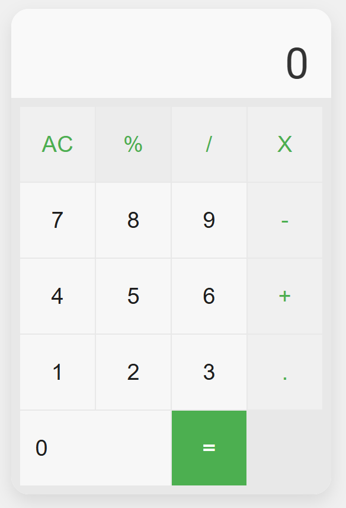

# 🔢 HTML Calculator with JavaScript

This is a simple calculator built using HTML, CSS, and JavaScript. It features a clean interface and supports basic arithmetic operations.

---

## 🚀 Live Demo

<!-- Uncomment and update the URL below once you enable GitHub Pages -->
[👉 View Calculator Live](https://akibashfaq.github.io/HTML-Calculator-With-JS/)

Or [📂 click here to open the calculator file directly](HTML/Calculator.html)

---

## 📝 Project Description

This calculator allows users to perform basic arithmetic operations such as addition, subtraction, multiplication, and division. It has a responsive design and is built with beginner-friendly code.

---

## ✨ Features

- ➕ Addition, ➖ Subtraction, ✖️ Multiplication, ➗ Division
- 🔄 Clear (AC) button to reset inputs
- 📉 Percentage (%) button for calculations
- 🔢 Decimal support for floating-point numbers
- 📱 Responsive design

---

## 🛠️ Technologies Used

- **HTML5** – Structure of the calculator
- **CSS3** – Styling and layout
- **JavaScript** – Functionality and interactivity

---

## 📌 How to Use

1. Clone the repository or download the ZIP
2. Open `HTML/Calculator.html` in your browser
3. Click the buttons to perform calculations
4. Use:
   - `AC` to clear
   - `%` for percentage
   - `.` for decimal numbers

---

## 📁 Project Structure
 
Project-Based-Learning/ 
│ 
├── HTML/ 
│ └── Calculator.html # Main calculator HTML file 
│ 
├── CSS/ 
│ └── Calculator.css # Styling for the calculator 
│ 
├── JS/ 
│ └── Calculator.js # JavaScript logic 
│ 
└── README.md # Project description 